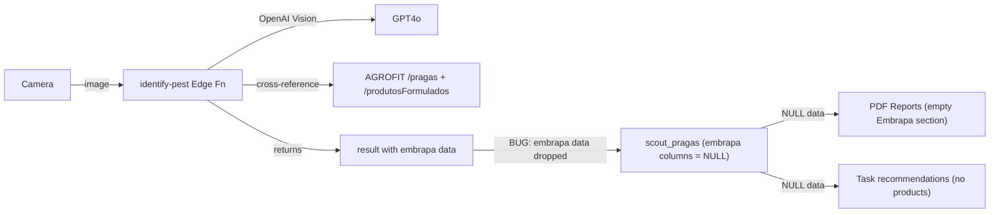

# Embrapa AGROFIT Integration - Full Pipeline Fix

## Current State and Critical Bug

The Edge Function `identify-pest` (v8) correctly calls AGROFIT `/pragas` and `/produtosFormulados` and returns enriched data. However, **the data is lost at save time**: `doConfirm` in [reconhecimento/index.tsx](mobile/src/app/(tabs)/reconhecimento/index.tsx) inserts into `scout_pragas` without `embrapa_praga_id` or `embrapa_produtos_recomendados`. All rows in the DB have these columns as NULL.

## API Decision: AGROFIT v1 Only

- **AGROFIT v1** (`/pragas`, `/search/produtos-formulados`, `/culturas`, etc.) covers everything: pest catalog, formulated products (chemical AND biological via `produto_biologico=true` filter), toxicological classifications, application techniques, dosage info
- **Bioinsumos v2** only adds inoculants (soil health, not pest control) - not needed now
- Both APIs share the same OAuth2 credentials already configured in `.env`

## AGROFIT Endpoints We Use / Should Use

Currently used in Edge Function:

- `/pragas?nomePraga=X` - find pest by name (returns classification, scientific name, cultures)
- `/produtosFormulados?codPraga=X` - find recommended products for a pest

Should also leverage (via `embrapa-proxy` or enhanced Edge Function):

- `/search/produtos-formulados?praga_nome_comum=X&cultura=Y` - products filtered by pest AND crop (critical for talhao-aware recommendations)
- `/search/produtos-formulados?produto_biologico=true&praga_nome_comum=X` - biological alternatives

## Changes

### Phase 1: Fix the data pipeline (critical)

**1a. Save Embrapa data in `doConfirm**` ([reconhecimento/index.tsx](mobile/src/app/(tabs)/reconhecimento/index.tsx) lines 140-154)

The `DetectedPestEntry` type in the store needs to carry `embrapa` data through. Currently it only has `name`, `scientificName`, `confidence`, `severity`, `pestType`, `recommendation`, `boundingBox`, `contagem`.

- Add `embrapaId?: string` and `embrapaProdutos?: any[]` to `DetectedPestEntry` in [reconhecimento-result-store.ts](mobile/src/stores/reconhecimento-result-store.ts)
- Populate these fields in `openResultScreen` in [reconhecimento/index.tsx](mobile/src/app/(tabs)/reconhecimento/index.tsx) from `result.embrapa`
- In `doConfirm`, include `embrapa_praga_id` and `embrapa_produtos_recomendados` in the `scout_pragas` insert rows

**1b. Enhance Edge Function search with culture context**

When the user selects a talhao before scanning, we know the `cultura_atual`. Pass it to the Edge Function so it can use `/search/produtos-formulados?praga_nome_comum=X&cultura=Y` for culture-specific product recommendations instead of generic ones.

- Pass `cultura` in the request body from the mobile app
- In `crossReferenceEmbrapa`, use the advanced search endpoint when culture is available.
- Edge: map cultura enum (SOJA, MILHO) to API name (Soja, Milho) via `culturaForApi()` before calling Embrapa.

### Phase 2: Enrich pest_reference_vectors automatically

**2a. After successful identification + confirmation**, if the pest name is new (not in `pest_reference_vectors`), auto-insert a reference row with:

- `nome_praga`, `nome_cientifico` from OpenAI
- `descricao_visual` from OpenAI recommendation
- `fonte` = 'AI_IDENTIFIED'
- `imagem_referencia_url` from uploaded image
- This happens inside the Edge Function, not the mobile app

### Phase 3: Use Embrapa data in reports and recommendations

**3a. Task recommendations** - When creating/viewing a task for a talhao with pests, show Embrapa-recommended products from the stored `embrapa_produtos_recomendados` in `scout_pragas`. This data is already fetched in the detail RPC and displayed in the bottom sheet.

**3b. PDF reports** ([report-service.ts](mobile/src/services/report-service.ts) lines 85-98) already reads `embrapa_produtos_recomendados` from `scout_pragas` - it will work automatically once Phase 1 is complete and data is actually saved.

### Phase 4: Future growth (no code changes now, just architecture notes)

- **Bioinsumos integration**: Add when building a soil health / crop growth module. Same OAuth2 credentials, just different base URL (`/bioinsumos/v2`)
- **Agritec integration**: Embrapa also offers [Agritec v2](https://www.agroapi.cnptia.embrapa.br/store/apis/info?name=Agritec&version=v2&provider=agroapi) for planting calendar (ZARC), cultivar recommendations, and soil correction - useful for a future "planejamento de safra" module
- **Product cache table**: If AGROFIT gets slow or rate-limited, create `embrapa_products_cache` table to store frequently queried products locally with TTL

