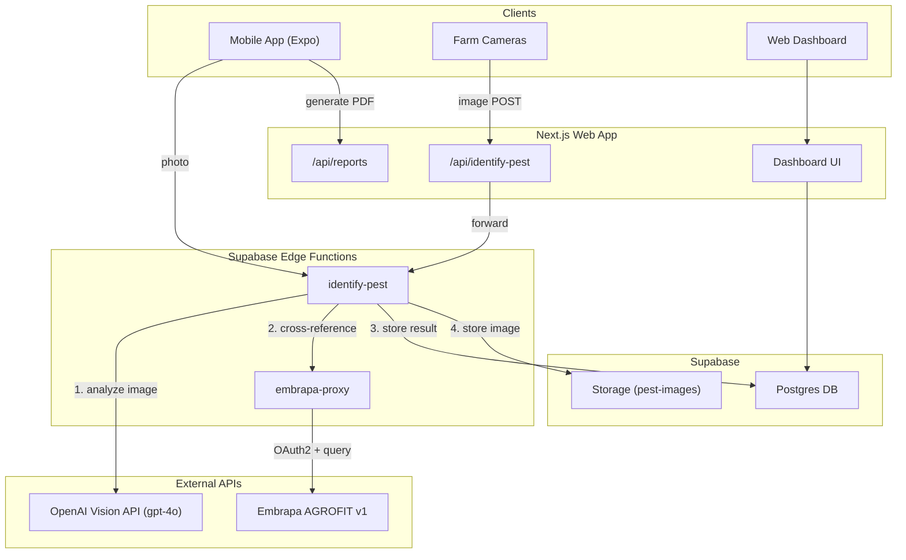

# Embrapa AGROFIT + OpenAI Vision + PDF Reports Integration

## Architecture Overview



## Part 1: Supabase Edge Functions

### 1A. `embrapa-proxy` Edge Function

Handles OAuth2 token management and proxies requests to Embrapa AGROFIT API. Keeps `EMBRAPA_CONSUMER_KEY` and `EMBRAPA_CONSUMER_SECRET` server-side (never exposed to mobile).

- **Token flow**: POST to `https://api.cnptia.embrapa.br/token` with Basic auth (`consumer_key:consumer_secret`), cache token until expiry
- **Endpoints proxied**:
  - `GET /pragas` - pest catalog
  - `GET /plantasDaninhas` - weeds
  - `GET /culturas` - crops  
  - `GET /produtosFormulados` - recommended products
- **Auth**: Requires valid Supabase JWT (verify_jwt: true)
- **Secrets needed**: `EMBRAPA_CONSUMER_KEY`, `EMBRAPA_CONSUMER_SECRET`, `EMBRAPA_TOKEN_URL`

### 1B. `identify-pest` Edge Function

Core function that combines OpenAI Vision analysis with Embrapa AGROFIT cross-reference.

- **Input**: Base64 image + optional metadata (fazenda_id, talhao_id, latitude, longitude)
- **Flow**:
  1. Call OpenAI Vision API (gpt-4o) with agricultural pest identification prompt
  2. Extract pest name from AI response
  3. Query Embrapa AGROFIT `/pragas` to find matching pest entry
  4. Query Embrapa AGROFIT `/produtosFormulados` for recommended products
  5. Upload image to Supabase Storage bucket `pest-images`
  6. Optionally save result to `scout_marker_pragas` table
  7. Return enriched response (AI identification + Embrapa catalog data + product recommendations)
- **Auth**: Requires valid Supabase JWT
- **Secrets needed**: `OPENAI_API_KEY`, plus Embrapa secrets (calls embrapa-proxy internally or directly)

### 1C. Supabase Storage Bucket

- Create `pest-images` bucket (public: false) to store uploaded pest photos

## Part 2: Mobile App Changes

### 2A. Update `openai-service.ts`

Refactor [`mobile/src/services/openai-service.ts`](mobile/src/services/openai-service.ts) to call the `identify-pest` Edge Function instead of calling OpenAI directly. This:
- Moves API key to server-side (more secure)
- Adds Embrapa cross-reference automatically
- Returns enriched results

### 2B. Create `embrapa-service.ts`

New file `mobile/src/services/embrapa-service.ts` to call the `embrapa-proxy` edge function for browsing the Embrapa catalog (pest list, products, etc.).

### 2C. Update `use-pragas.ts` and `reconhecimento.tsx`

Update the recognition flow in [`mobile/src/hooks/use-pragas.ts`](mobile/src/hooks/use-pragas.ts) and [`mobile/src/app/(tabs)/reconhecimento.tsx`](mobile/src/app/(tabs)/reconhecimento.tsx) to:
- Display Embrapa-enriched results (recommended products, scientific classification)
- Show Embrapa product recommendations in the result modal
- Store image URL from Storage

### 2D. PDF Report Generation (Mobile)

Use `expo-print` + `expo-sharing` (already available in Expo) to generate PDFs from HTML templates.

- Create `mobile/src/services/report-service.ts` with two functions:
  - `generateTechnicalReport(data)` - "Relatório Técnico: Monitoramento de Pragas e Doenças"
  - `generatePestDiseaseReport(data)` - "Relatório de Pragas e Doenças" (heat map variant)
- Create `mobile/src/templates/report-technical.ts` - HTML template for technical report
- Create `mobile/src/templates/report-pest-disease.ts` - HTML template for pest/disease report
- Both templates follow the exact structure from the reference PDFs:
  - Header (app name, fazenda, area, date, responsible)
  - Resumo Executivo
  - Map placeholder / heat map placeholder
  - Detalhamento por Praga (table + recommendations)
  - Detalhamento por Doença
  - Comparativo Histórico (table)
  - Recomendações de Manejo Geral
  - Conclusão
  - Assinatura e Validação
- Add a "Relatórios" tab or section in the app to generate/preview/share these PDFs

## Part 3: Next.js Web App (`web/`)

### 3A. Create Next.js App

Initialize Next.js project in `web/` directory with:
- Next.js 14+ (App Router)
- TypeScript
- Tailwind CSS
- Supabase client library

### 3B. API Route: `POST /api/identify-pest`

Endpoint for receiving images from farm cameras:

```typescript
// web/src/app/api/identify-pest/route.ts
export async function POST(request: Request) {
  // Accept multipart/form-data with image
  // Forward to Supabase Edge Function 'identify-pest'
  // Store result in database
  // Return identification result
}
```

- Accepts: `multipart/form-data` (image file) or `application/json` (base64)
- Optional headers: `X-Fazenda-ID`, `X-Talhao-ID`, `X-Camera-ID`
- Returns: JSON with pest identification + Embrapa cross-reference
- Auth: API key based (for cameras) - validated via custom header

### 3C. API Route: `POST /api/reports/generate`

Server-side PDF generation using `@react-pdf/renderer` or `puppeteer`:

```typescript
// web/src/app/api/reports/generate/route.ts
export async function POST(request: Request) {
  // Accept report type ('technical' | 'pest-disease')
  // Accept fazenda_id, date range, filters
  // Query Supabase for data
  // Generate PDF
  // Return PDF file or upload to Storage and return URL
}
```

### 3D. Simple Dashboard Page

A basic dashboard at `web/src/app/page.tsx` showing:
- Recent pest identifications from cameras
- Quick stats
- Link to generate reports

## Part 4: Database Additions

### 4A. Migration: Add `pest_images` and `camera_identifications` support

Add columns to `scout_marker_pragas`:
- `imagem_url` (text, nullable) - URL to stored pest image
- `fonte` (text, nullable) - Source: 'MOBILE', 'CAMERA', 'WEB'
- `openai_confidence` (numeric, nullable) - AI confidence score
- `embrapa_praga_id` (text, nullable) - Embrapa catalog pest ID
- `embrapa_produtos_recomendados` (jsonb, nullable) - Embrapa recommended products

## Implementation Order

The work is organized to deliver value incrementally: Edge Functions first (shared backend), then mobile updates, then web app.
